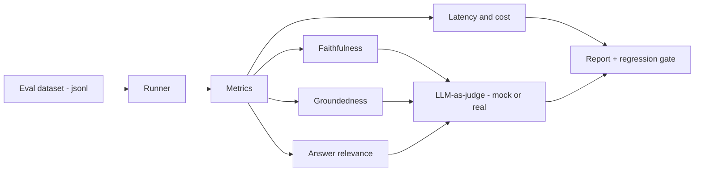

<h1 align="center">Enterprise AI Evaluation Platform</h1>

<p align="center">
  <b>Measure whether your enterprise AI agents can be trusted in production.</b><br>
  A framework for evaluating LLM & RAG agents on the metrics that actually decide adoption:
  faithfulness, groundedness, answer quality, latency, and cost.
</p>

<p align="center">
  
  
  
</p>

---

## Why this exists

Most enterprise AI projects fail not because the model is weak, but because **no one can prove the outputs are trustworthy**. Business teams won't adopt an AI agent they can't verify, and "it looks good in the demo" is not an evaluation strategy.

BLEU and ROUGE were built for translation, not for enterprise RAG and agents. They tell you almost nothing about whether an answer is *grounded in the source*, *factually correct*, or *safe to put in front of a finance or legal team*.

This platform is a practical, opinionated harness for the questions that matter:

- **Is the answer faithful to the retrieved context, or is the model hallucinating?**
- **Is it grounded — can we trace every claim back to a source?**
- **Is it actually answering the question?**
- **What does it cost, and how fast is it, at production volume?**
- **Did a prompt or model change make things quietly worse?** (regression gates)

> Built by a practitioner who ships enterprise AI agents in production. The design reflects a simple belief: for enterprise AI, **evaluation and trust are the product**, not an afterthought.

---

## What it does

| Capability | Description |
|---|---|
| **Quality metrics** | Faithfulness, groundedness, answer relevance — scored by an LLM-as-judge with rubric prompts |
| **Operational metrics** | Per-query latency and token/cost accounting |
| **Pluggable judges** | Ship with a mock judge (runs offline, no API key) or plug in a real LLM judge |
| **Dataset-driven** | Evaluate against a versioned `.jsonl` eval set — repeatable, reviewable |
| **Regression gates** | Fail CI when scores drop below a threshold, so prompt/model changes can't silently degrade quality |
| **Readable reports** | Per-example and aggregate scorecards in the terminal and as JSON/HTML |

---

## Quickstart

```bash
git clone https://github.com/vikas2987/enterprise-ai-eval-platform.git
cd enterprise-ai-eval-platform
pip install -r requirements.txt

# Runs fully offline with the built-in mock judge:
python -m eval_platform.runner --dataset datasets/example_eval_set.jsonl

# To use a real LLM judge (Anthropic):
export ANTHROPIC_API_KEY=sk-...
python -m eval_platform.runner --dataset datasets/example_eval_set.jsonl --judge anthropic
```

Example output:

```
Enterprise AI Evaluation Platform — run report
------------------------------------------------
examples evaluated ......... 5
faithfulness (avg) ......... 0.91
groundedness (avg) ......... 0.88
answer_relevance (avg) ..... 0.93
latency p50 / p95 (ms) ..... 620 / 1180
est. cost (avg, USD) ....... 0.0041
------------------------------------------------
REGRESSION GATE: PASS (min faithfulness 0.85 >= 0.80)
```

---

## How it works



Each record in the dataset carries a `question`, the `contexts` the agent retrieved, the `answer` it produced, and optionally a `reference` answer. The runner scores every record across all metrics, aggregates the results, and applies configurable regression gates.

See [`docs/evaluation-methodology.md`](docs/evaluation-methodology.md) for the thinking behind each metric, and [`docs/metrics.md`](docs/metrics.md) for exact definitions.

---

## Repository layout

```
enterprise-ai-eval-platform/
├── src/eval_platform/
│   ├── metrics/            # faithfulness, groundedness, relevance, operational
│   ├── evaluators/         # LLM-as-judge implementations (mock + anthropic)
│   ├── runner.py           # orchestrates a full evaluation run
│   └── report.py           # scorecards + regression gates
├── datasets/               # versioned eval sets (.jsonl)
├── examples/               # worked example: evaluating a RAG agent
├── docs/                   # methodology & metric definitions
└── tests/                  # unit tests for the metrics
```

---

## Roadmap

- [ ] Graph-RAG-aware retrieval-completeness metric (did we retrieve *all* relevant nodes?)
- [ ] HTML dashboard for run-over-run trend tracking
- [ ] Adversarial / red-team question packs for enterprise agents
- [ ] Human-in-the-loop labeling workflow to calibrate the LLM judge

---

## License

MIT — see [LICENSE](LICENSE).

---

<p align="center"><i>Maintained by Vikas Shukla — AI Product & Platform leader focused on enterprise AI evaluation, trust, and reliability.</i></p>
