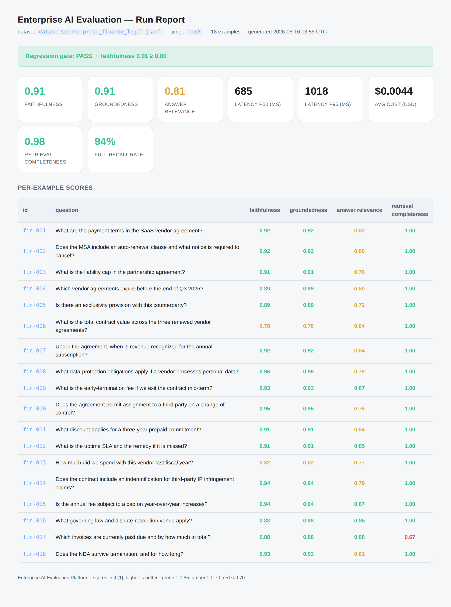
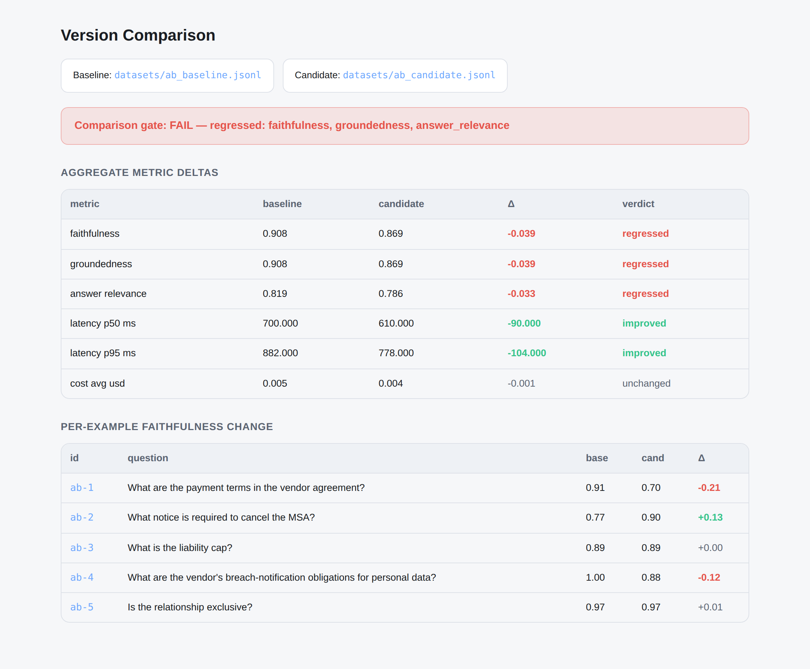
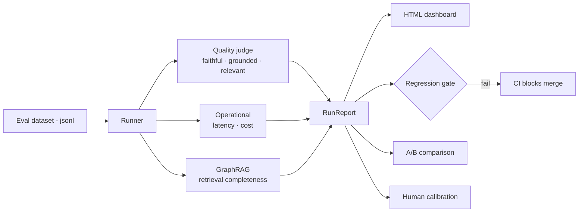

<h1 align="center">Enterprise AI Evaluation Platform</h1>

<p align="center">
  <b>Prove your enterprise AI agents can be trusted in production — before they ship.</b><br>
  An opinionated harness for evaluating LLM &amp; RAG agents on the metrics that actually
  decide adoption: faithfulness, groundedness, retrieval completeness, latency, and cost.
</p>

<p align="center">
  
  
  
  
</p>

---

## The problem

Most enterprise AI projects don't stall because the model is weak. They stall because
**no one can prove the outputs are trustworthy.** A finance or legal team will not put an
agent in front of a client on the strength of "it looked good in the demo."

And the usual metrics don't help. BLEU and ROUGE measure n-gram overlap with a reference
string — built for translation, blind to the things enterprise RAG lives or dies on:

- A fluent, confident, **hallucinated** answer scores *well* on overlap.
- They say nothing about whether an answer is **grounded in the retrieved source**.
- They can't see what **retrieval missed** — the quiet failure that sinks multi-hop agents.

## Who it's for & the jobs it does

| User | Job to be done |
|---|---|
| **AI/ML engineer** | "Before I merge a prompt or model change, tell me if quality quietly regressed." |
| **AI product manager** | "Give me a scorecard I can show a stakeholder that says *why* this agent is trustworthy." |
| **Platform / MLOps** | "Gate the eval in CI so a bad change can't reach production." |
| **Risk / compliance partner** | "Show me the answer is grounded and auditable, and that retrieval was complete." |

## What it measures

| Capability | Answers the question | How |
|---|---|---|
| **Faithfulness** | Is the answer true to the retrieved context, or hallucinated? | LLM-as-judge, rubric-scored |
| **Groundedness** | Can every claim be traced to a source (auditable)? | LLM-as-judge, rubric-scored |
| **Answer relevance** | Does it actually answer the question? | LLM-as-judge, rubric-scored |
| **GraphRAG retrieval** | Did we retrieve **all** the relevant nodes, or silently miss one? | Measured from node sets |
| **Latency & cost** | Is it fast and cheap enough at production volume? | Measured, p50/p95 + $/query |
| **Regression gate** | Did this change make anything worse? | Threshold → CI exit code |

---

## The dashboard

One command turns an eval set into a self-contained HTML scorecard — no server, no
dependencies. Green is healthy; amber and red are where a reviewer looks first.



> Note the red `0.67` on `fin-017`: the answer is correct, but **retrieval missed a
> relevant node**. Quality metrics alone would never have caught that — the GraphRAG
> completeness metric does.

---

## Catch a silent regression (prompt/model A·B)

The scenario every AI team fears: a "small" prompt tweak that's faster and cheaper — and
quietly less faithful. Run the same questions through both versions and diff them:

```bash
python -m eval_platform.compare \
  --baseline datasets/ab_baseline.jsonl \
  --candidate datasets/ab_candidate.jsonl \
  --html reports/compare.html
```



The candidate is ~15% faster — but faithfulness dropped because it started hallucinating on
payment terms. The **comparison gate fails with a non-zero exit code**, so the "improvement"
never merges. That's the whole point.

---

## Quickstart

```bash
git clone https://github.com/vikas2987/enterprise-ai-eval-platform.git
cd enterprise-ai-eval-platform
pip install -e ".[dev]"        # or: pip install -r requirements.txt

# 1) Evaluate a run (offline mock judge, no API key) + write the dashboard:
python -m eval_platform.runner \
  --dataset datasets/enterprise_finance_legal.jsonl \
  --html reports/run.html

# 2) A/B two versions and gate on regressions:
python -m eval_platform.compare \
  --baseline datasets/ab_baseline.jsonl \
  --candidate datasets/ab_candidate.jsonl

# 3) Calibrate the judge against human labels:
python -m eval_platform.human_eval agreement \
  --dataset datasets/enterprise_finance_legal.jsonl \
  --labels datasets/human_labels_sample.csv

# Use a real LLM judge instead of the mock:
export ANTHROPIC_API_KEY=sk-...
python -m eval_platform.runner --dataset datasets/enterprise_finance_legal.jsonl --judge anthropic
```

```
Enterprise AI Evaluation Platform — run report
------------------------------------------------
examples evaluated ......... 18
faithfulness (avg)........ 0.91
groundedness (avg)........ 0.91
answer_relevance (avg).... 0.81
latency p50 / p95 (ms) ..... 685 / 1018
est. cost (avg, USD) ....... 0.0044
------------------------------------------------
GraphRAG retrieval (nodes)
  completeness (avg) ....... 0.98
  precision (avg) .......... 1.00
  full-recall rate ......... 94%
------------------------------------------------
REGRESSION GATE: PASS (min faithfulness 0.91 >= 0.80)
```

---

## Keep the judge honest (human calibration)

An LLM judge scales, but it is **not** ground truth. Export its scores, have a human label
the same examples, and measure agreement — per metric, with error and correlation:

```bash
# Export a labeling sheet (judge scores filled, human columns blank):
python -m eval_platform.human_eval export \
  --dataset datasets/enterprise_finance_legal.jsonl --out reports/to_label.csv
# A reviewer fills human_* columns, then:
python -m eval_platform.human_eval agreement \
  --dataset datasets/enterprise_finance_legal.jsonl --labels reports/to_label.csv
```

```
Judge ↔ human calibration
--------------------------------------------------------
metric                 n     MAE    corr  verdict
faithfulness           8   0.122    0.72  acceptable
groundedness           8   0.127    0.72  acceptable
answer_relevance       8   0.079    0.34  acceptable
```

In the bundled sample, the human scores a hallucinated invoice answer far lower than the
mock judge does — exactly the drift signal you use to re-tune the rubric before trusting it.

---

## How it works



Each dataset record carries the `question`, the `contexts` retrieved, the `answer`, and —
optionally — a `reference`, graph `retrieved_nodes`/`relevant_nodes`, and `latency_ms`/
`cost_usd`. See **[docs/architecture.md](docs/architecture.md)** for the full design,
**[docs/evaluation-methodology.md](docs/evaluation-methodology.md)** for *why* each metric,
and **[docs/metrics.md](docs/metrics.md)** for exact definitions.

---

## Repository layout

```
enterprise-ai-eval-platform/
├── src/eval_platform/
│   ├── metrics/            # quality (judged) · operational · graph (GraphRAG)
│   ├── evaluators/         # LLM-as-judge: mock (offline) + anthropic
│   ├── runner.py           # orchestrates a run · --html dashboard
│   ├── report.py           # scorecards, HTML dashboard, regression gate
│   ├── compare.py          # prompt/model A·B comparison + gate
│   └── human_eval.py       # export-for-labeling + judge↔human calibration
├── datasets/               # Finance/Legal eval set, A/B pair, sample labels
├── docs/                   # architecture, methodology, metrics, demo script
├── examples/               # worked example: evaluating a RAG agent
└── tests/                  # unit tests (pytest)
```

---

## Design principles

- **Evaluation and trust *are* the product** — not an afterthought bolted on before launch.
- **Pluggable judges.** Anything implementing the `Judge` protocol drops in — mock, a real
  LLM, an ensemble, your own model.
- **Zero hard runtime dependencies.** The whole pipeline — dashboard and calibration math
  included — runs on the standard library with the offline mock judge, so it works in CI and
  demos with no API key.
- **Every path ends in a gate.** A run or a comparison resolves to a boolean → a CI exit
  code. Quality regressions block merges the way a failing test does.

## Roadmap

- [x] GraphRAG retrieval-completeness metric
- [x] HTML dashboard
- [x] Prompt/model version comparison with a CI gate
- [x] Human-in-the-loop labeling + judge calibration
- [ ] Run-over-run trend tracking (history + sparklines)
- [ ] Adversarial / red-team question packs for enterprise agents
- [ ] Ensemble-judge and confidence intervals on scores

---

## License

MIT — see [LICENSE](LICENSE).

---

<p align="center"><i>Maintained by Vikas Shukla — AI Product &amp; Platform leader focused on
enterprise AI evaluation, trust, and reliability.</i></p>
