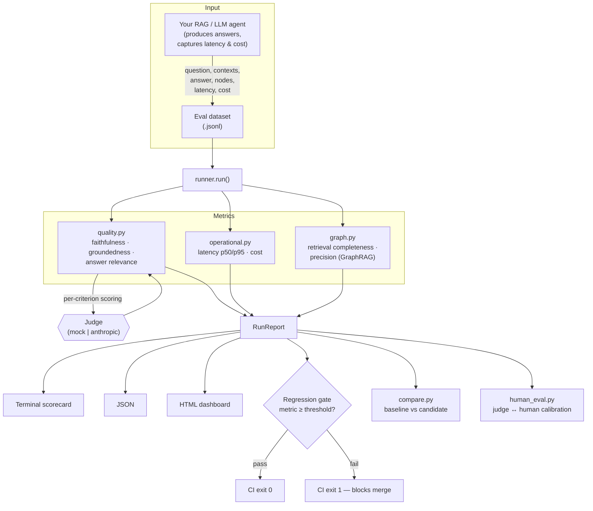

# Architecture

The platform is a small, dependency-light pipeline. Data flows left to right:
a versioned eval dataset goes in, and a scored report (terminal, JSON, or HTML
dashboard) plus a pass/fail regression gate comes out. Every stage is a plain
Python module you can import and test in isolation.

## System overview

## Components

| Module | Responsibility | Key entry points |
|---|---|---|
| `runner.py` | Load a dataset, score every record, aggregate, build the report, run the gate. CLI + `--html`. | `run()`, `load_dataset()`, `main()` |
| `metrics/quality.py` | Judge-scored quality metrics for one record. | `score_quality()`, `QUALITY_METRICS` |
| `metrics/operational.py` | Measured latency percentiles and cost aggregation. | `aggregate_operational()` |
| `metrics/graph.py` | GraphRAG retrieval completeness & precision from node sets. | `score_graph_record()`, `aggregate_graph()` |
| `evaluators/judge.py` | The `Judge` protocol + `MockJudge` (offline) and `AnthropicJudge` (real LLM). | `get_judge()` |
| `report.py` | `RunReport`: terminal render, JSON, and the self-contained HTML dashboard; the gate. | `RunReport`, `to_html()` |
| `compare.py` | A/B two runs; per-metric deltas + regression gate for prompt/model changes. | `compare_datasets()`, `compare_reports()` |
| `human_eval.py` | Export labeling CSV, re-import, score judge↔human agreement (calibration). | `export_for_labeling()`, `agreement()` |

## Design choices

- **The judge is a protocol, not a class hierarchy.** Anything with a
  `score(criterion, *, question, answer, contexts, reference)` method plugs in.
  Swap the mock for a real LLM, an ensemble, or your own model without touching
  the runner.
- **Quality is judged; operations and retrieval are measured.** Keeping these
  separate means a slow-but-accurate agent and a fast-but-hallucinating agent
  produce visibly different scorecards.
- **The dataset is the contract.** A record carries everything needed to score
  it — question, retrieved contexts, the answer, optional reference, optional
  graph nodes, and optional latency/cost. Missing optional fields degrade
  gracefully (e.g. no node fields → the GraphRAG section is simply omitted).
- **Zero hard dependencies.** The whole pipeline — including the HTML dashboard
  and calibration math — runs on the standard library with the mock judge, so
  it works in CI and demos with no API key.
- **The gate is the product.** Every path (single run, comparison) ends in a
  boolean that maps to a CI exit code, so quality regressions block merges the
  same way a failing unit test does.
